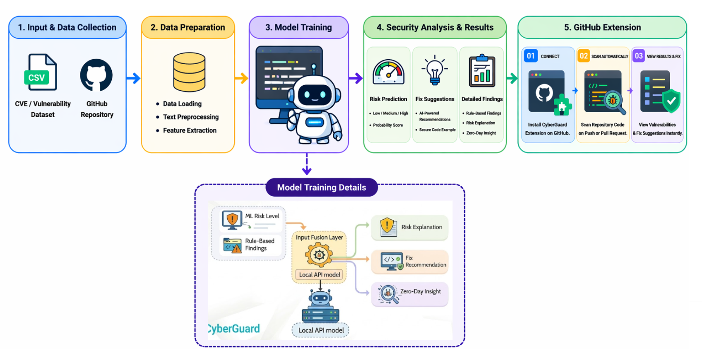
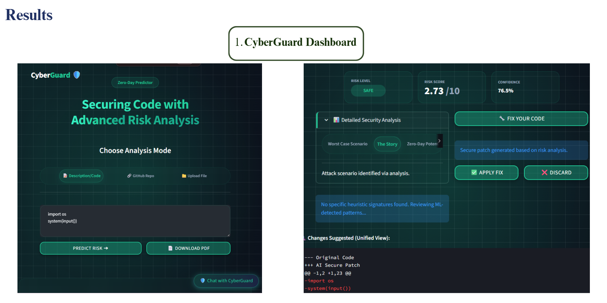

# 🛡 CyberGuard

AI-Powered Real-Time Zero-Day Threat Detection Platform

Detect vulnerabilities before deployment.
Predict severity.
Generate secure fixes.
Integrate with GitHub.
## Tech Stack

Backend:
Python
Flask

ML:
XGBoost
Scikit-learn

AI:
Gemini API

Frontend:
Streamlit

Dataset:
NVD API
CVE Dataset

## System Architecture

## Dashboard

# Features

✔ Zero Day Prediction

✔ CVE Analysis

✔ XGBoost Model

✔ GitHub Scanner

✔ Chrome Extension

✔ AI Generated Fixes

✔ Explainable Security Reports

✔ PDF Export

✔ Multiple Analysis Modes

## Research Publication

[CyberGuard IEEE](CyberGuardIEEE-2.pdf)
